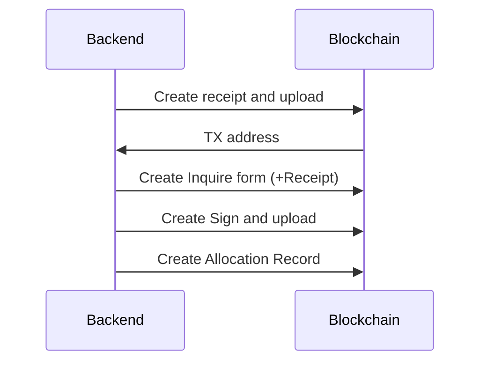

# DepRank

### Project Tree

.
├── LICENSE
├── README.md
├── Scarb.lock
├── Scarb.toml
├── makefile
├── snfoundry.toml
├── docs
│   └── cario-book-llms-full.txt
├── src
│   ├── allocation.cairo---------------------
│   ├── inquire.cairo------------------------ Allow sending proofs
│   ├── lib.cairo---------------------------- 
│   ├── receipt.cairo------------------------ Receipt contract
│   ├── sign.cairo--------------------------- 
│   └── workflow.cairo----------------------- Workflow contract
└── tests
    ├── test_contract.cairo
    └── test_workflow.cairo

### Data Model Structure

```
GitHub Owner
│
├── Workflow 1
│   ├── Dependency 1
│   │   ├── Step 1 (Type: receipt)
│   │   ├── Step 2 (Type: inquire)
│   │   └── Step 3 (Type: sign)
│   │
│   ├── Dependency 2
│   │   ├── Step 1
│   │   └── Step 2
│   │
│   └── Dependency 3
│       └── Step 1
│
└── Workflow 2
    ├── Dependency 1
    │   ├── Step 1
    │   └── Step 2
    │
    └── Dependency 2
        └── Step 1
```

### Association Analysis

1. **GitHub Owner -> Workflow**:
   - Uses `github_owner`(felt252) as key, with `workflow_count` tracking the number of workflows owned by each owner
   - Accesses specific workflows via composite key `(github_owner, workflow_id)`

2. **Workflow -> Dependency**:
   - Each workflow's dependency count is tracked by `workflow_dependency_count`
   - Dependency details are accessed via composite key `(github_owner, workflow_id, dependency_index)`

3. **Dependency -> Step**:
   - Step count for each dependency is tracked by `workflow_steps_count`
   - Step details are accessed via composite key `(github_owner, workflow_id, dependency_index, step_index)`

### Storage Structure

```
Storage {
    // Workflow storage
    workflow_count: Map<felt252, u256>,                  // github_owner -> count
    workflows: Map<(felt252, u256), WorkflowDetails>,    // (owner, id) -> details
    
    // Dependency storage
    workflow_dependency_count: Map<(felt252, u256), u256>,               // (owner, wf_id) -> count
    dependencies: Map<(felt252, u256, u256), DependencyDetails>,         // (owner, wf_id, dep_id) -> details
    
    // Step storage
    workflow_steps_count: Map<(felt252, u256, u256), u256>,              // (owner, wf_id, dep_id) -> count  
    workflow_steps: Map<(felt252, u256, u256, u256), StepDetails>,       // (owner, wf_id, dep_id, step_id) -> details
    
    // Hash mapping
    tx_hash_to_step: Map<felt252, (felt252, u256, u256, u256)>  // tx_hash -> (owner, wf_id, dep_id, step_id)
}
```

### DepRank Sequence


